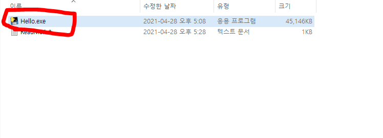
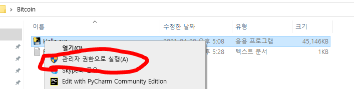
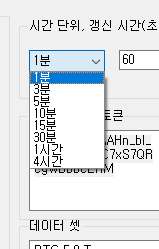
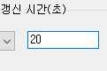
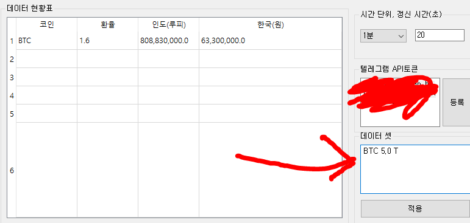

# BitcoinAutoProcess
텔레그램을 활용함.

```
1단계: 텔레그램 API 등록하기
2단계: 실행 방법
3단계: 시간 단위, 매초마다 갱신하기
4단계: 데이터셋 쓰기
```

## 1단계 텔레그램 API 등록하기(생략)
- 모바일이나 웹을 방문하기. (모바일 기준으로 설명합니다.)

## 2단계 실행 방법
- 0

- 1

- 2

- 3

- 4

갱신시간 입력칸에 10를 입력하고 Enter 키를 누르시면 10초마다 갱신되도록 설정됩니다.
- 5

- 6

- 7

- 8

