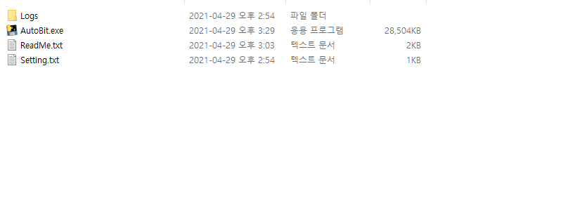
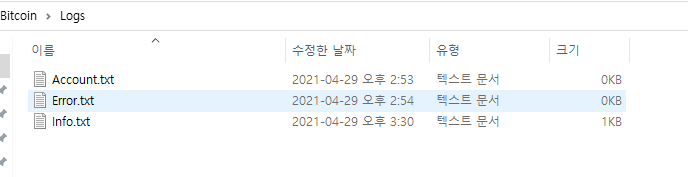
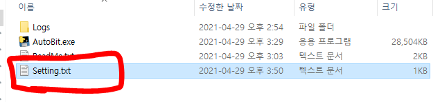
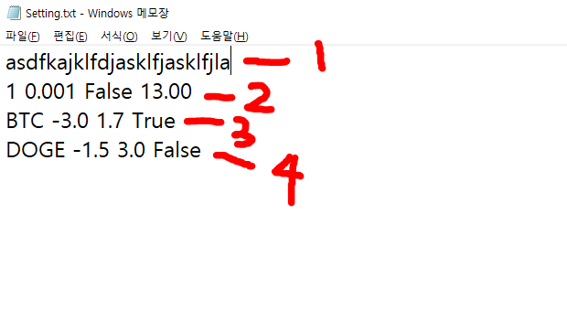
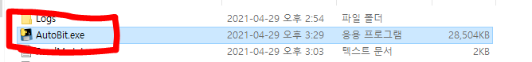
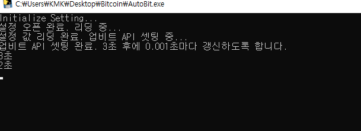
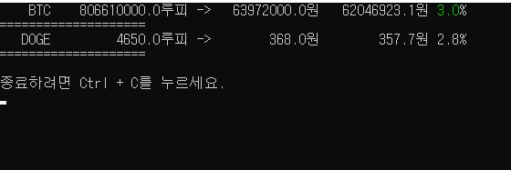
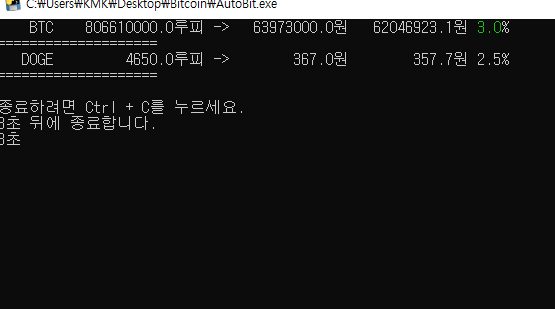

# BitcoinAutoProcess(GUI, CMD)
텔레그램을 활용함.

# BitcoinAutoProcess(GUI)
```
1단계: 텔레그램 API 등록하기
2단계: 실행 방법
3단계: 시간 단위, 매초마다 갱신하기
4단계: 데이터셋 쓰기
```
## 1단계 텔레그램 API 등록하기(생략)
- 모바일이나 웹을 방문하기. (모바일 기준으로 설명합니다.)

## 2단계 실행 방법
- 0

- 1

- 2

## 3단계 시간 단위, 매초마다 갱신하기
- 3

- 4

갱신시간 입력칸에 10를 입력하고 Enter 키를 누르시면 10초마다 갱신되도록 설정됩니다.
## 4단계 데이터셋 쓰기(변경: (단위) (최소 조건) (최대 조건) (알람 설정) Ex: BTC 1.0 2.2 T)
- 5

- 6


# BitcoinAutoProcess(CMD)
```
1단계: 준비물 확인(Log 관련 파일, exe 실행 파일, 셋팅 설정 파일)
2단계: Setting.txt
3단계: 실행
```
## 1단계 준비물 확인
- 0

- 1

## 2단계 Setting.txt 구조 및 사용 방법
- 2

- 3

- 4

- 5

- 6

- 7

