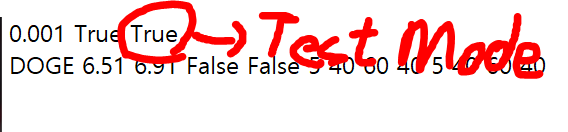

# Version 1.1.0

---

# 패치 내역
- 자동 매매 기능 추가
  - 테스트 모드 기능 추가
  - 멀티쓰레딩으로 효율 처리 추가
  - 바이낸스 API, 업비트 API 입력칸 추가
  - 자동매매 변수 입력칸 추가
  - 코드 최적화 성공(기존 갱신 시간 1.1s -> 0.3s 3배 효율)및 모듈 추가

---

# [API 발급 받는 방법](https://github.com/alsrua7222/BitcoinAutoProcess/tree/main/API)

---

# Setting.txt

### [세부 사항](https://github.com/alsrua7222/BitcoinAutoProcess/tree/main/resouce/Setting)

---

# 테스트 모드(거래 활성화 ON)
## 필수 입력
Upbit, Binance API 무조건 입력하셔야 합니다.   
## 셋팅 방법
   
True를 설정한 후, 해당 코인의 거래 활성화 ON을 해서 실행하면 됩니다.   

---

# 작동 원리
